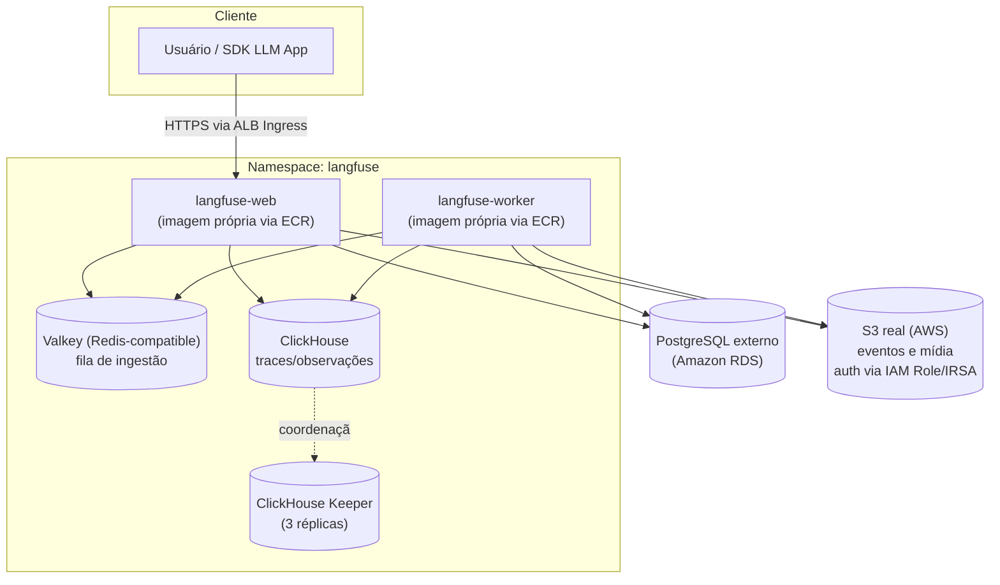

# Stack Langfuse — Documentação

> Documentação técnica da stack de observabilidade de LLMs **Langfuse**, implantada via
> [Helm chart oficial](https://langfuse.github.io/langfuse-k8s) (`langfuse/langfuse`,
> **chart 2.1.0 / appVersion 4.24.0**).
>
> Fontes: [github.com/langfuse/langfuse-k8s](https://github.com/langfuse/langfuse-k8s)
> (README + `charts/langfuse/values.yaml` + `examples/minimal-installation/`),
> **Context7** (`/langfuse/langfuse-docs`) + validação direta com `helm template` /
> `helm lint` **e builds reais dos Dockerfiles** contra o chart/imagens reais (seção 9).

---

## 1. Objetivo

Disponibilizar o **Langfuse** — plataforma open source de observabilidade, avaliação e
gerenciamento de prompts para aplicações LLM — em Amazon EKS, com imagens próprias via
**ECR**, **Postgres externo (RDS)**, S3 real via **IAM Role** e Redis/ClickHouse
bundled no cluster.

---

## 2. Arquitetura



---

## 3. Serviços da stack

| Serviço | Papel | Imagem | Arquivo de values | Réplicas | Persistência |
|---|---|---|---|---|---|
| **web** | App Next.js (UI + API) do Langfuse | `<ECR>/langfuse-web:4.24.0` (build próprio via `docker/web/Dockerfile`, FROM `docker.langfuse.com/langfuse/langfuse:4.24.0`) | `web.yaml` | 2 | — |
| **worker** | Processamento assíncrono (ingestão, batch export) | `<ECR>/langfuse-worker:4.24.0` (via `docker/worker/Dockerfile`) | `worker.yaml` | 2 | — |
| **postgresql** | Metadados, usuários, projetos, configuração | **Externo — Amazon RDS**, não gerenciado por este chart | `web.yaml`/`worker.yaml` (`DATABASE_URL` via `additionalEnv`) | — (gerenciado fora do Helm) | — |
| **redis** (Valkey) | Fila de ingestão consumida pelo worker + cache | `docker.io/valkey/valkey:8.0` (subchart `valkey-io/valkey`) | `worker.yaml` | 1 (standalone) | 8Gi (default do chart) |
| **clickhouse** | Armazenamento analítico de traces/observações (sink do worker) | `clickhouse/clickhouse-server:26.4` (CR `ClickHouseCluster` via ClickHouse Operator) | `worker.yaml` | 1 (cluster habilitado) | 3Gi |
| **clickhouse-keeper** | Coordenação/consenso do cluster ClickHouse | `clickhouse/clickhouse-keeper:26.4` (CR `KeeperCluster`) | `worker.yaml` | 3 | 3Gi cada |
| **s3** | Armazenamento de objetos (eventos, mídia, exports) — usado por web e worker | S3 real, auth via IAM Role/IRSA (`s3.deploy: false`) | `web.yaml` | — | — |

Todas as credenciais (exceto Postgres, que é externo com `DATABASE_URL` completo, e S3,
que usa IAM Role) vêm de **um único arquivo, `secrets.yaml`** (um `Secret` Kubernetes
chamado **`langfuse-secrets`**, no namespace `langfuse`) — ver seção 5.

**Só 2 arquivos de values** (`web.yaml`, `worker.yaml`) + `secrets.yaml` — sem
`values.yaml`/`eks.yaml`/`postgres.yaml` genéricos. Cada bloco de configuração vive no
arquivo do serviço mais associado a ele:

- **`web.yaml`**: tudo "voltado pra fora" — app (salt/encryptionKey/nextauth/bootstrap
  headless/`DATABASE_URL`), Ingress (ALB), ServiceAccount (IRSA), S3 e a própria imagem
  do web (`langfuse.web.image`).
- **`worker.yaml`**: o pipeline de ingestão que o worker processa — Redis (fila
  consumida pelo worker), ClickHouse (destino dos eventos) e a imagem do worker
  (`langfuse.worker.image`), além do app duplicado (mesmo padrão de auto-suficiência).

Como o Helm faz merge por chave top-level (`langfuse`, `redis`, `clickhouse`, `s3`),
**não importa em qual arquivo `-f` cada chave está** — o resultado final é idêntico
independente de onde a configuração foi colocada. Essa distribuição é uma escolha de
organização/legibilidade, não uma exigência técnica.

⚠️ **Cuidado com chaves top-level erradas**: uma versão anterior destes arquivos usava
blocos `web:`/`worker:`/`postgresql: {enabled: false}` no **topo** do YAML — essas
chaves **não existem no schema do chart** e eram silenciosamente ignoradas (Helm não
falha em chave desconhecida). A config real fica em `langfuse.web.*`/
`langfuse.worker.*` (aninhada dentro de `langfuse:`), e o toggle correto é
`postgresql.deploy` (não `enabled`). Ver seção 9 para o registro completo dos bugs
encontrados e corrigidos.

Os Dockerfiles em `docker/web/Dockerfile` e `docker/worker/Dockerfile` **fazem `FROM`
das imagens oficiais** (`docker.langfuse.com/langfuse/langfuse(-worker):4.24.0`) e
servem de base para build/push no seu próprio ECR — ver `DEPLOY.md`, seção 0.6.
Confirmado via `docker inspect` ao vivo: ambas as imagens são **Alpine** (não
Debian/Ubuntu); os Dockerfiles usam `apk`, não `apt-get`.

---

## 4. Pré-requisitos

- **Kubernetes ≥ 1.28**, **Helm ≥ 3.17** (suporte a `fromToml`, exigido pelo chart)
- **cert-manager** (`v1.20.2` recomendado) e **ClickHouse Kubernetes Operator**
  (`0.0.5` recomendado) — ver `DEPLOY.md`, seção 0.2/0.3
- `kubectl` configurado apontando para o cluster alvo
- **O release Helm precisa se chamar exatamente `langfuse`** — os hostnames internos
  (`langfuse-redis`, `langfuse-clickhouse-headless`) dependem desse nome de release.

Procedimento completo (com comandos de verificação) em **[DEPLOY.md](./DEPLOY.md)**,
seção 0.

### Amazon EKS (alvo padrão desta stack)

`web.yaml`/`worker.yaml` já vêm configurados para EKS por padrão: Ingress via **AWS
Load Balancer Controller** (ALB), imagens via **ECR**, S3 real via **IAM Role (IRSA)**
— sem access key/secret key fixos —, StorageClass `gp3` (EBS) para Redis/ClickHouse/
Keeper, e **Postgres externo (RDS)**. Pré-requisitos adicionais, comandos de build/push
para o ECR e a policy IAM mínima para a Role IRSA em **[DEPLOY.md](./DEPLOY.md)**,
seções 0.5–0.7.

### Testando em Kind/local (sem AWS real)

Como a stack assume EKS + RDS por padrão, testar em Kind exige sobrescrever valores via
`--set` (Ingress desativado, imagens oficiais em vez do ECR, StorageClass vazia, S3
apontando para MinIO local, e um Postgres real acessível já que não há mais Postgres
bundled) — comandos prontos em **[DEPLOY.md](./DEPLOY.md)**, seção 4.1. Nunca
provisionar recursos AWS reais/pagos só para testar localmente.

### Ambiente local via Docker Compose (alternativa mais rápida ao Kind)

`docker-compose/` contém uma stack equivalente baseada no `docker-compose.yml` oficial
do Langfuse v4 (confirmado via Context7), com **Postgres e MinIO locais** (não RDS/IAM
Role — Compose não tem identidade de pod nem gerencia RDS), adaptada com os mesmos
valores de laboratório de `secrets.yaml`:

```bash
cd docker-compose
cp .env.example .env   # ajuste se quiser valores diferentes dos defaults
docker compose up -d
```

Diferenças em relação ao deploy K8s (Kind/EKS):

| Item | K8s (EKS) | Docker Compose |
|---|---|---|
| Postgres | Externo (RDS) | Container local |
| ClickHouse | Cluster + 3 Keepers via Operator | Container único, `CLICKHOUSE_CLUSTER_ENABLED: false` (sem Keeper) |
| Redis/Valkey | ACL via Secret montado como volume | Senha via `--requirepass` |
| S3 | Real (IAM Role) | MinIO local |
| Segredos | `secrets.yaml` (K8s `Secret` "langfuse-secrets") | `docker-compose/.env` (nunca commitado) |
| Bootstrap headless | `langfuse.additionalEnv` no chart | Env vars diretas no `docker-compose.yml` |

⚠️ **Gotcha do Postgres 18+**: a imagem oficial `postgres:18` exige que `PGDATA` fique
num subdiretório do volume montado, senão o container entra em crash loop reclamando de
"unused mount" — `docker-compose.yml` já define `PGDATA` corretamente.

```bash
docker compose down          # para os containers, mantém os volumes
docker compose down -v       # para e apaga os volumes (reset completo)
```

---

## 5. Segredos (secrets.yaml)

Todas as credenciais da stack — app (salt/encryption-key/nextauth-secret), Postgres
externo (`DATABASE_URL` completo), Redis/Valkey, ClickHouse e o bootstrap headless
(org/projeto/usuário/API key automáticos) — ficam em **um único arquivo,
`secrets.yaml`**: um manifesto `Secret` Kubernetes (`kind: Secret`, nome
**`langfuse-secrets`**, namespace `langfuse`) aplicado com `kubectl apply -f
secrets.yaml` **antes** do `helm install`/`upgrade` (ver `DEPLOY.md`, seção 3). Nenhum
values file contém senha em texto claro — todos referenciam esse Secret via
`existingSecret`/`secretKeyRef`.

**S3 não usa nenhum segredo** — autentica via IAM Role (IRSA), configurada em
`web.yaml` (`langfuse.serviceAccount.annotations`).

| Arquivo | Chave(s) usadas de `secrets.yaml` | Wiring no values |
|---|---|---|
| `web.yaml` / `worker.yaml` | `salt`, `encryption-key`, `nextauth-secret` | `langfuse.salt.secretKeyRef`, `langfuse.encryptionKey.secretKeyRef`, `langfuse.nextauth.secret.secretKeyRef` |
| `web.yaml` / `worker.yaml` | `DATABASE_URL` (Postgres externo/RDS) | `langfuse.additionalEnv[].valueFrom.secretKeyRef` |
| `web.yaml` / `worker.yaml` | `LANGFUSE_INIT_*` (9 chaves) | `langfuse.additionalEnv[].valueFrom.secretKeyRef` |
| `worker.yaml` | `redis-password`, `default` | `redis.auth.existingSecret`/`existingSecretPasswordKey` **e** `redis.auth.usersExistingSecret` (dois consumidores distintos) |
| `worker.yaml` | `clickhouse-password` | `clickhouse.auth.existingSecret`/`existingSecretKey` |

⚠️ **`secrets.yaml` contém segredos em texto claro (valores de laboratório, exceto
`DATABASE_URL` que já precisa apontar para um Postgres real)** — nunca reutilizar em
produção sem trocar as senhas. Trate como arquivo sensível: **não commitar com valores
reais** (adicione ao `.gitignore` fora do laboratório) e, para homolog/produção,
prefira gerar via secret manager externo (Vault, AWS Secrets Manager, External Secrets
Operator) em vez de um YAML versionado.

### Postgres externo (RDS) — sem config estruturada

Diferente de versões anteriores deste projeto (que usavam um Postgres bundled com
usuário dedicado `langfuse`), esta stack usa **Postgres externo (RDS)**: a conexão
inteira vem de `DATABASE_URL` (uma connection string completa) via `additionalEnv` —
**não** defina `postgresql.host`/`postgresql.auth.*` (config estruturada) em nenhum
arquivo. O chart valida essa exclusividade e `helm template` **falha** se ambos
estiverem presentes simultaneamente. `postgresql.deploy: false` está em `web.yaml`.

### Variáveis válidas do bootstrap headless (`LANGFUSE_INIT_*`)

Confirmado via Context7 (`/langfuse/langfuse-docs`) — só existem estas 9 variáveis;
qualquer outra **não é lida pela aplicação**:

| Variável | Obrigatória p/ criar o recurso |
|---|---|
| `LANGFUSE_INIT_ORG_ID` | Sim |
| `LANGFUSE_INIT_ORG_NAME` | Não |
| `LANGFUSE_INIT_PROJECT_ID` | Sim |
| `LANGFUSE_INIT_PROJECT_NAME` | Não |
| `LANGFUSE_INIT_PROJECT_RETENTION` | Não (dias de retenção; vazio = para sempre) |
| `LANGFUSE_INIT_PROJECT_PUBLIC_KEY` | Sim |
| `LANGFUSE_INIT_PROJECT_SECRET_KEY` | Sim |
| `LANGFUSE_INIT_USER_EMAIL` | Sim |
| `LANGFUSE_INIT_USER_NAME` | Não |
| `LANGFUSE_INIT_USER_PASSWORD` | Sim |

A URL pública da app é controlada por `langfuse.nextauth.url` (já wired em
`web.yaml`/`worker.yaml`) — **não** por uma variável `LANGFUSE_INIT_*`.

### Atualizando segredos após o deploy inicial

```bash
kubectl apply -f secrets.yaml
kubectl rollout restart deployment/langfuse-web deployment/langfuse-worker -n langfuse
```

`secretKeyRef` não é recarregado a quente pelo Kubernetes — o `rollout restart` é
necessário para os pods lerem os novos valores.

⚠️ **O bootstrap headless não é idempotente para atualização, só para criação**: se
você mudar `LANGFUSE_INIT_PROJECT_PUBLIC_KEY`/`_SECRET_KEY` mantendo o mesmo
`LANGFUSE_INIT_PROJECT_ID`, o Langfuse cria uma **API key adicional** — a antiga
continua válida. Para revogar, use a UI (Project Settings → API Keys) ou a API.

---

## 6. Estrutura de arquivos

```text
langfuse/
├── README.md              # este documento
├── DEPLOY.md               # procedimento de deploy passo a passo
├── secrets.yaml             # Secret K8s "langfuse-secrets" — credenciais (exceto S3, via IAM Role)
├── web.yaml                 # app (salt/encryptionKey/nextauth/DATABASE_URL/bootstrap) + langfuse.web (imagem ECR) + Ingress ALB + ServiceAccount IRSA + S3
├── worker.yaml               # app (duplicado) + langfuse.worker (imagem ECR) + Redis/Valkey + ClickHouse + Keeper
├── docker/
│   ├── web/Dockerfile          # FROM docker.langfuse.com/langfuse/langfuse:4.24.0 (Alpine) — build/push pro ECR
│   └── worker/Dockerfile        # FROM docker.langfuse.com/langfuse/langfuse-worker:4.24.0 (Alpine) — idem
├── docker-compose/
│   ├── docker-compose.yml   # stack completa (web/worker/postgres/valkey/clickhouse/minio) p/ rodar local
│   └── .env.example          # valores de laboratório (copiar p/ .env, nunca commitar)
└── tests/
    ├── teste-langfuse.py       # valida envio de trace via SDK Python
    ├── teste-otel.py           # valida fluxo RAG (span + generation aninhados)
    └── teste-sdk.py            # exemplo básico de instrumentação
```

---

## 7. Resumo Executivo

### Objetivo

Prover uma plataforma self-hosted de observabilidade para aplicações de IA/LLM
(rastreamento de prompts, custos de tokens, avaliação de qualidade), rodando em Amazon
EKS com imagens próprias e Postgres gerenciado (RDS).

### Benefícios

- **Técnicos**: observabilidade nativa para chamadas de LLM (traces, spans,
  generations), sem enviar dados sensíveis para SaaS de terceiros.
- **Operacionais**: imagens versionadas no próprio ECR; Postgres gerenciado (RDS) tira
  a operação do banco das mãos da equipe de plataforma (backups, patching, HA geridos
  pela AWS).
- **Segurança**: S3 autenticado via IAM Role (IRSA) — nenhuma credencial estática de
  object storage circulando em Secrets ou values.
- **Financeiros**: elimina custo de licenciamento SaaS do Langfuse Cloud; custo passa a
  ser apenas a infraestrutura já existente do cliente.

### Riscos

| Risco | Impacto | Mitigação |
|---|---|---|
| `secrets.yaml` contém segredos em texto claro (valores de laboratório) | Alto | Nunca commitar com valores reais; usar secret manager externo em homolog/prod (ver seção 5) |
| Redis e ClickHouse com 1 réplica cada (exceto Keeper) | Médio | Sem HA real; avaliar `cluster.replicas` maior para homolog/prod |
| Sem `NetworkPolicy` definida | Médio | Adicionar antes de expor publicamente |
| Ingress/TLS/IRSA/ECR/RDS (`web.yaml`/`worker.yaml`) usam placeholders (`<...>`) — não funcionam até serem substituídos | Alto | Preencher antes do deploy; `helm template` não valida se são reais |
| Mistura de `additionalEnv` (DATABASE_URL) com config estruturada do Postgres quebra o `helm template` | Alto | Nunca definir `postgresql.host`/`auth.*` junto com `DATABASE_URL` via additionalEnv (ver seção 5) |
| ClickHouse Operator + cert-manager são pré-requisitos externos ao chart | Médio | Comandos de instalação documentados na seção 4 / `DEPLOY.md` seção 0 |
| ClickHouse Kubernetes Operator é classificado como *alpha-quality* pelo próprio chart do Langfuse | Médio | Revisar release notes antes de upgrades; fixar a versão do operator explicitamente (`--version`) |
| Imagens no ECR não fixam SHA256 (só tag) | Baixo | Fixar digest antes de produção |

### Custos (Cost Drivers)

| Serviço | Motivo do custo | Observações |
|---|---|---|
| Compute (nós do cluster) | CPU/memória para web (×2), worker (×2), redis, clickhouse e 3 keepers | Sem contar keeper, sem limite definido no request somado |
| RDS PostgreSQL | Instância gerenciada (compute + storage + backups) | Custo depende da classe de instância escolhida — fora do escopo deste chart |
| Armazenamento EBS `gp3` | Persistência de ClickHouse (3Gi) + Keeper (3× 3Gi = 9Gi) + Redis (8Gi) | Total ≈ 20Gi de volumes persistentes |
| ECR | Armazenamento de imagens + data transfer | Baixo, cobrado por GB armazenado |
| S3 | Eventos e mídia do Langfuse | Armazenamento + requests; zero custo de credencial (IAM Role) |
| ALB | Load Balancer do Ingress | Custo fixo por hora + por LCU; certificado ACM é gratuito |
| Licenciamento | Nenhum — Langfuse é open source (self-hosted) | Sem custo de software |

> Estimativa qualitativa — não há preços fechados pois depende da região AWS, classe
> da instância RDS e dos nós/volumes escolhidos.

---

## 8. Próximos passos

Veja **[DEPLOY.md](./DEPLOY.md)** para o procedimento de instalação passo a passo.

---

## 9. Validação executada

```bash
helm repo add langfuse https://langfuse.github.io/langfuse-k8s
helm repo update

helm template langfuse langfuse/langfuse -n langfuse \
  -f web.yaml -f worker.yaml \
  --api-versions clickhouse.com/v1alpha1/ClickHouseCluster \
  --api-versions clickhouse.com/v1alpha1/KeeperCluster

helm lint <chart-local> -f web.yaml -f worker.yaml --set clickhouse.crdCheck=false
```

Resultado: **0 erros**. Numa revisão do repositório (após edições externas aos
arquivos), encontrei e corrigi um conjunto de bugs reais — chaves que não existem no
schema do chart e são silenciosamente ignoradas pelo Helm (não falha em chave
desconhecida), então `helm lint`/`helm template` **passam mesmo com a stack quebrada**:

| Problema encontrado | Evidência | Correção |
|---|---|---|
| `secrets.yaml` renomeado para `langfuse-secrets`, mas o Postgres bundled (`postgres.yaml`) ainda referenciava `existingSecret: langfuse` | Confirmado no manifesto renderizado: `secretKeyRef.name: langfuse` (secret inexistente) — pod ficaria em `CreateContainerConfigError` | Postgres passou a ser **externo (RDS)** via `DATABASE_URL`; `postgres.yaml` removido, `postgresql.deploy: false` |
| Bloco top-level `web:`/`worker:` (não `langfuse.web`/`langfuse.worker`) | `replicaCount`, `image.*`, `env.*`, `ingress.*` dentro desses blocos — todos ignorados; `replicas` ficava 1 (não 2), imagem/Ingress/NEXTAUTH_URL/S3 real nunca aplicavam | Todo o conteúdo movido para `langfuse.web.*`/`langfuse.worker.*` |
| `postgresql.enabled: false` / `redis.enabled` / `clickhouse.enabled` | `enabled` não existe no schema (chave real é `deploy`) | Removidas; `deploy` já presente onde necessário |
| `DATABASE_URL` (additionalEnv) coexistindo com `postgresql.deploy: true` (config estruturada) | Ambíguo — Postgres bundled tentaria subir e falhar mesmo com RDS configurado | `postgresql.deploy: false`, nenhuma config estruturada — validei que `helm template` não falha nessa combinação (confirma que o chart aceita `additionalEnv`-only para Postgres externo) |
| `docker/web/Dockerfile`/`docker/worker/Dockerfile`: `FROM langfuse/langfuse(-worker):3` | Tag existe no Docker Hub, mas é uma major anterior à v4 exigida por este chart | Trocado para `:4.24.0`, mesma versão validada em `web.yaml`/`worker.yaml` |
| `docker/web/Dockerfile`: `RUN apt-get ...` | **Build real falhou**: `apt-get: not found` — confirmado via `docker inspect` que a imagem é **Alpine**, não Debian | Trocado para `apk add --no-cache curl` — rebuild confirmado com sucesso |

> `--api-versions ...` simula as CRDs do ClickHouse Operator apenas para permitir a
> renderização offline (`crdCheck: true` bloqueia `helm template` sem um cluster real
> conectado, que é o comportamento correto para um `helm install` de verdade).

**Validado com builds reais**: `docker build` das duas imagens corrigidas teve
sucesso, e `docker run` de ambas produziu o erro esperado (`DATABASE_URL not set`),
confirmando que `ENTRYPOINT`/`USER` continuam intactos (não foram quebrados pelas
correções).
