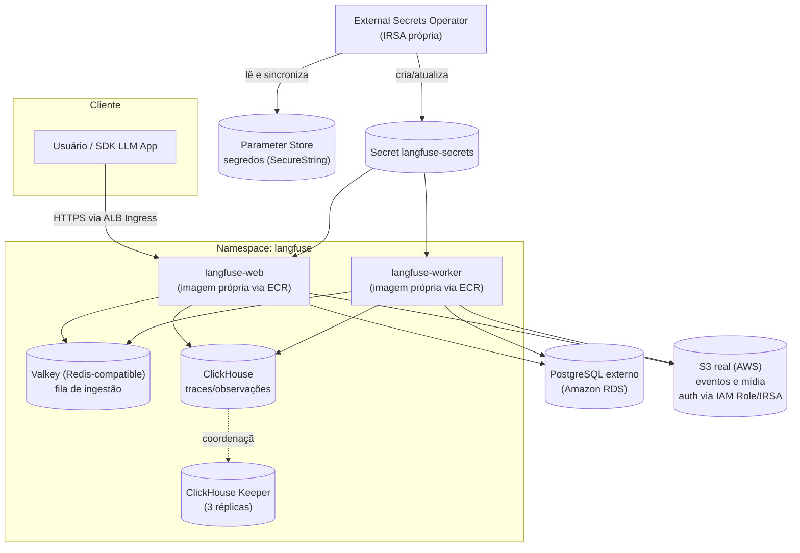

# Stack Langfuse — Documentação

> Documentação técnica da stack de observabilidade de LLMs **Langfuse**, implantada via
> [Helm chart oficial](https://langfuse.github.io/langfuse-k8s) (`langfuse/langfuse`,
> **chart 2.1.0 / appVersion 4.24.0**).
>
> Fontes: [github.com/langfuse/langfuse-k8s](https://github.com/langfuse/langfuse-k8s)
> (README + `charts/langfuse/values.yaml` + `examples/minimal-installation/`),
> **Context7** (`/langfuse/langfuse-docs`) + validação direta com `helm template` /
> `helm lint` **e builds reais dos Dockerfiles** contra o chart/imagens reais (seção 9).

---

## 1. Objetivo

Disponibilizar o **Langfuse** — plataforma open source de observabilidade, avaliação e
gerenciamento de prompts para aplicações LLM — em Amazon EKS, com imagens próprias via
**ECR**, **Postgres externo (RDS)**, S3 real via **IAM Role** e Redis/ClickHouse
bundled no cluster.

---

## 2. Arquitetura



---

## 3. Serviços da stack

| Serviço | Papel | Imagem | Arquivo de values | Réplicas | Persistência |
|---|---|---|---|---|---|
| **web** | App Next.js (UI + API) do Langfuse | `<ECR>/langfuse-web:4.24.0` (build próprio via `docker/Dockerfile --target web`, FROM `docker.langfuse.com/langfuse/langfuse:4.24.0`) | `values.yaml` | 2 | — |
| **worker** | Processamento assíncrono (ingestão, batch export) | `<ECR>/langfuse-worker:4.24.0` (via `docker/Dockerfile --target worker`) | `values.yaml` | 2 | — |
| **postgresql** | Metadados, usuários, projetos, configuração | **Externo — Amazon RDS**, não gerenciado por este chart | `values.yaml` (`DATABASE_URL` via `additionalEnv`) | — (gerenciado fora do Helm) | — |
| **redis** (Valkey) | Fila de ingestão consumida pelo worker + cache | `docker.io/valkey/valkey:8.0` (subchart `valkey-io/valkey`) | `values.yaml` | 1 (standalone) | 8Gi (default do chart) |
| **clickhouse** | Armazenamento analítico de traces/observações (sink do worker) | `clickhouse/clickhouse-server:26.4` (CR `ClickHouseCluster` via ClickHouse Operator) | `values.yaml` | 1 (cluster habilitado) | 3Gi |
| **clickhouse-keeper** | Coordenação/consenso do cluster ClickHouse | `clickhouse/clickhouse-keeper:26.4` (CR `KeeperCluster`) | `values.yaml` | 3 | 3Gi cada |
| **s3** | Armazenamento de objetos (eventos, mídia, exports) — usado por web e worker | S3 real, auth via IAM Role/IRSA (`s3.deploy: false`) | `values.yaml` | — | — |
| **external-secrets** | Sincroniza segredos do Parameter Store para o Secret `langfuse-secrets` (homolog/prod) | `external-secrets/external-secrets` (Helm, instalado à parte, namespace próprio) | `external-secrets/*.yaml` | 1 (operator) | — |

Todas as credenciais (exceto Postgres, que é externo com `DATABASE_URL` completo, e S3,
que usa IAM Role) vêm de **um único `Secret` Kubernetes chamado `langfuse-secrets`**,
no namespace `langfuse` — em homolog/prod, criado e sincronizado pelo **External
Secrets Operator a partir do AWS Parameter Store** (`external-secrets/*.yaml`); em
Kind/lab, aplicado estaticamente via `secrets.local.yaml` — ver seção 5.

**Um único arquivo de values do chart, `values.yaml`** — todas as chaves top-level do
schema (`langfuse`, `postgresql`, `seaweedfs`, `s3`, `redis`, `clickhouse`) num só
lugar, mais os manifests de `external-secrets/` à parte (não são values do chart, são
CRDs do ESO aplicados antes do `helm install`). Sem `eks.yaml`/`postgres.yaml`
genéricos. Dentro de `langfuse:` ficam: app (salt/encryptionKey/nextauth/bootstrap
headless/`DATABASE_URL`), Ingress (ALB), ServiceAccount (IRSA), a imagem do web
(`langfuse.web.image`) e a do worker (`langfuse.worker.image`); `redis`/`clickhouse`
cobrem a fila de ingestão e o sink analítico consumidos pelo worker.

⚠️ **Cuidado com chaves top-level erradas**: uma versão anterior deste arquivo usava
blocos `web:`/`worker:`/`postgresql: {enabled: false}` no **topo** do YAML — essas
chaves **não existem no schema do chart** e eram silenciosamente ignoradas (Helm não
falha em chave desconhecida). A config real fica em `langfuse.web.*`/
`langfuse.worker.*` (aninhada dentro de `langfuse:`), e o toggle correto é
`postgresql.deploy` (não `enabled`). Ver seção 9 para o registro completo dos bugs
encontrados e corrigidos.

> Um arquivo único (`values.yaml`) em vez do `web.yaml`/`worker.yaml` separados usado
> anteriormente: o Helm faz merge por chave top-level de qualquer forma, então dividir
> em múltiplos arquivos `-f` só duplicava blocos (`salt`/`encryptionKey`/`nextauth`/
> `additionalEnv` apareciam idênticos nos dois) sem nenhum ganho funcional — `helm
> template` com `values.yaml` produz exatamente o mesmo manifesto renderizado
> (validado byte a byte, ver seção 9).

Um único `docker/Dockerfile` (multi-stage, stages `web` e `worker`) **faz `FROM`
das imagens oficiais** (`docker.langfuse.com/langfuse/langfuse(-worker):4.24.0`) em
cada stage e serve de base para build/push no seu próprio ECR — `docker build
--target web|worker -f docker/Dockerfile docker`, ver `DEPLOY.md`, seção 0.6.
Confirmado via `docker inspect` ao vivo: ambas as imagens são **Alpine** (não
Debian/Ubuntu); o Dockerfile usa `apk`, não `apt-get`.

---

## 4. Pré-requisitos

- **Kubernetes ≥ 1.28**, **Helm ≥ 3.17** (suporte a `fromToml`, exigido pelo chart)
- **cert-manager** (`v1.20.2` recomendado) e **ClickHouse Kubernetes Operator**
  (`0.0.5` recomendado) — ver `DEPLOY.md`, seção 0.2/0.3
- `kubectl` configurado apontando para o cluster alvo
- **O release Helm precisa se chamar exatamente `langfuse`** — os hostnames internos
  (`langfuse-redis`, `langfuse-clickhouse-headless`) dependem desse nome de release.

Procedimento completo (com comandos de verificação) em **[DEPLOY.md](./DEPLOY.md)**,
seção 0.

### Amazon EKS (alvo padrão desta stack)

`values.yaml` já vem configurado para EKS por padrão: Ingress via **AWS
Load Balancer Controller** (ALB), imagens via **ECR**, S3 real via **IAM Role (IRSA)**
— sem access key/secret key fixos —, StorageClass `gp3` (EBS) para Redis/ClickHouse/
Keeper, segredos via **External Secrets Operator + AWS Parameter Store** (IRSA própria,
separada da de S3), e **Postgres externo (RDS)**. Pré-requisitos adicionais, comandos de
build/push para o ECR, a policy IAM mínima para as Roles IRSA (S3 e Parameter Store) e
o passo a passo do ESO em **[DEPLOY.md](./DEPLOY.md)**, seções 0.5–0.7.1.

### Testando em Kind/local (sem AWS real)

Como a stack assume EKS + RDS por padrão, testar em Kind exige sobrescrever valores via
`--set` (Ingress desativado, imagens oficiais em vez do ECR, StorageClass vazia, S3
apontando para MinIO local, e um Postgres real acessível já que não há mais Postgres
bundled) — comandos prontos em **[DEPLOY.md](./DEPLOY.md)**, seção 4.1. Nunca
provisionar recursos AWS reais/pagos só para testar localmente.

### Ambiente local via Docker Compose (alternativa mais rápida ao Kind)

`docker-compose/` contém uma stack equivalente baseada no `docker-compose.yml` oficial
do Langfuse v4 (confirmado via Context7), com **Postgres e MinIO locais** (não RDS/IAM
Role — Compose não tem identidade de pod nem gerencia RDS), adaptada com os mesmos
valores de laboratório de `secrets.local.yaml`:

```bash
cd docker-compose
cp .env.example .env   # ajuste se quiser valores diferentes dos defaults
docker compose up -d
```

Diferenças em relação ao deploy K8s (Kind/EKS):

| Item | K8s (EKS) | Docker Compose |
|---|---|---|
| Postgres | Externo (RDS) | Container local |
| ClickHouse | Cluster + 3 Keepers via Operator | Container único, `CLICKHOUSE_CLUSTER_ENABLED: false` (sem Keeper) |
| Redis/Valkey | ACL via Secret montado como volume | Senha via `--requirepass` |
| S3 | Real (IAM Role) | MinIO local |
| Segredos | Parameter Store via ESO (homolog/prod) ou `secrets.local.yaml` (Kind) — sempre Secret "langfuse-secrets" | `docker-compose/.env` (nunca commitado) |
| Bootstrap headless | `langfuse.additionalEnv` no chart | Env vars diretas no `docker-compose.yml` |

⚠️ **Gotcha do Postgres 18+**: a imagem oficial `postgres:18` exige que `PGDATA` fique
num subdiretório do volume montado, senão o container entra em crash loop reclamando de
"unused mount" — `docker-compose.yml` já define `PGDATA` corretamente.

```bash
docker compose down          # para os containers, mantém os volumes
docker compose down -v       # para e apaga os volumes (reset completo)
```

---

## 5. Segredos (Parameter Store + External Secrets Operator)

Todas as credenciais da stack — app (salt/encryption-key/nextauth-secret), Postgres
externo (`DATABASE_URL` completo), Redis/Valkey, ClickHouse e o bootstrap headless
(org/projeto/usuário/API key automáticos) — ficam em **um único `Secret` Kubernetes,
nome `langfuse-secrets`**, namespace `langfuse`. Nenhum values file contém senha em
texto claro — todos referenciam esse Secret via `existingSecret`/`secretKeyRef`. **Como
esse Secret é populado depende do ambiente** (confirmado via Context7,
`/websites/external-secrets_io`):

- **Homolog/prod**: o **External Secrets Operator** cria e sincroniza o Secret a
  partir do **AWS Systems Manager Parameter Store** (`SecureString`) — manifests em
  `external-secrets/` (`service-account.yaml`, `secret-store.yaml`,
  `external-secret.yaml`), aplicados **antes** do `helm install`/`upgrade` (ver
  `DEPLOY.md`, seções 0.7 e 3). Autenticação via **IRSA dedicada** (role separada da
  de S3), least-privilege (`ssm:GetParameter*` + `kms:Decrypt` restritos a
  `/langfuse/<AMBIENTE>/*`) — sem access key/secret key fixos.
- **Kind/lab**: `secrets.local.yaml`, um `Secret` estático com valores fixos de
  laboratório — **não versionado** (`.gitignore`, mesmo padrão de
  `docker-compose/.env`); copie do template commitado `secrets.local.yaml.example` e
  aplique com `kubectl apply -f secrets.local.yaml` (ver `DEPLOY.md`, seções 3 e 4.1).

**S3 não usa nenhum segredo** — autentica via IAM Role (IRSA), configurada em
`values.yaml` (`langfuse.serviceAccount.annotations`).

| Bloco em `values.yaml` | Chave(s) do Secret `langfuse-secrets` | Wiring no values |
|---|---|---|
| `langfuse.*` | `salt`, `encryption-key`, `nextauth-secret` | `langfuse.salt.secretKeyRef`, `langfuse.encryptionKey.secretKeyRef`, `langfuse.nextauth.secret.secretKeyRef` |
| `langfuse.*` | `DATABASE_URL` (Postgres externo/RDS) | `langfuse.additionalEnv[].valueFrom.secretKeyRef` |
| `langfuse.*` | `LANGFUSE_INIT_*` (9 chaves) | `langfuse.additionalEnv[].valueFrom.secretKeyRef` |
| `redis.*` | `redis-password`, `default` | `redis.auth.existingSecret`/`existingSecretPasswordKey` **e** `redis.auth.usersExistingSecret` (dois consumidores distintos) |
| `clickhouse.*` | `clickhouse-password` | `clickhouse.auth.existingSecret`/`existingSecretKey` |

O `ExternalSecret` (`external-secrets/external-secret.yaml`) mapeia cada uma dessas 15
chaves para um parâmetro `SecureString` em `/langfuse/<AMBIENTE>/<nome>` (ex.:
`DATABASE_URL` ← `/langfuse/<AMBIENTE>/database-url`) — `redis-password` e `default`
apontam para o **mesmo** parâmetro, já que o chart usa o mesmo valor em dois lugares
distintos (`existingSecretPasswordKey` e `usersExistingSecret`). Comandos completos de
`aws ssm put-parameter` para os 14 parâmetros em `DEPLOY.md`, seção 0.7.

⚠️ **`secrets.local.yaml.example` contém segredos em texto claro (valores de
laboratório, exceto `DATABASE_URL` que já precisa apontar para um Postgres real) —
nunca usar em homolog/produção**, apenas Kind/lab. O arquivo real (`secrets.local.yaml`,
copiado do `.example`) já está no `.gitignore` — nunca remova essa entrada nem force
o commit com valores reais.

### Postgres externo (RDS) — sem config estruturada

Diferente de versões anteriores deste projeto (que usavam um Postgres bundled com
usuário dedicado `langfuse`), esta stack usa **Postgres externo (RDS)**: a conexão
inteira vem de `DATABASE_URL` (uma connection string completa) via `additionalEnv` —
**não** defina `postgresql.host`/`postgresql.auth.*` (config estruturada) em nenhum
arquivo. O chart valida essa exclusividade e `helm template` **falha** se ambos
estiverem presentes simultaneamente. `postgresql.deploy: false` está em `values.yaml`.

### Variáveis válidas do bootstrap headless (`LANGFUSE_INIT_*`)

Confirmado via Context7 (`/langfuse/langfuse-docs`) — só existem estas 9 variáveis;
qualquer outra **não é lida pela aplicação**:

| Variável | Obrigatória p/ criar o recurso |
|---|---|
| `LANGFUSE_INIT_ORG_ID` | Sim |
| `LANGFUSE_INIT_ORG_NAME` | Não |
| `LANGFUSE_INIT_PROJECT_ID` | Sim |
| `LANGFUSE_INIT_PROJECT_NAME` | Não |
| `LANGFUSE_INIT_PROJECT_RETENTION` | Não (dias de retenção; vazio = para sempre) |
| `LANGFUSE_INIT_PROJECT_PUBLIC_KEY` | Sim |
| `LANGFUSE_INIT_PROJECT_SECRET_KEY` | Sim |
| `LANGFUSE_INIT_USER_EMAIL` | Sim |
| `LANGFUSE_INIT_USER_NAME` | Não |
| `LANGFUSE_INIT_USER_PASSWORD` | Sim |

A URL pública da app é controlada por `langfuse.nextauth.url` (já wired em
`values.yaml`) — **não** por uma variável `LANGFUSE_INIT_*`.

### Atualizando segredos após o deploy inicial

Homolog/prod: `aws ssm put-parameter ... --overwrite` + `kubectl annotate
externalsecret langfuse-secrets -n langfuse force-sync=$(date +%s) --overwrite` para
forçar a sincronização imediata (senão o ESO já resincroniza sozinho a cada
`refreshInterval`, 1h). Kind/lab: `kubectl apply -f secrets.local.yaml`. Em ambos os
casos:

```bash
kubectl rollout restart deployment/langfuse-web deployment/langfuse-worker -n langfuse
```

`secretKeyRef` não é recarregado a quente pelo Kubernetes — o `rollout restart` é
necessário para os pods lerem os novos valores. Comandos completos em `DEPLOY.md`,
seção 8.

⚠️ **O bootstrap headless não é idempotente para atualização, só para criação**: se
você mudar `LANGFUSE_INIT_PROJECT_PUBLIC_KEY`/`_SECRET_KEY` mantendo o mesmo
`LANGFUSE_INIT_PROJECT_ID`, o Langfuse cria uma **API key adicional** — a antiga
continua válida. Para revogar, use a UI (Project Settings → API Keys) ou a API.

---

## 6. Estrutura de arquivos

```text
langfuse/
├── README.md              # este documento
├── DEPLOY.md               # procedimento de deploy passo a passo
├── secrets.local.yaml.example # template do Secret K8s "langfuse-secrets" p/ Kind/lab (copiar p/ secrets.local.yaml, nunca commitado, NUNCA usar em homolog/prod)
├── values.yaml              # langfuse.* (salt/encryptionKey/nextauth/DATABASE_URL/bootstrap/web+worker image/Ingress ALB/ServiceAccount IRSA) + postgresql + s3 + redis + clickhouse
├── external-secrets/
│   ├── service-account.yaml   # ServiceAccount c/ IRSA dedicada (ssm:GetParameter*/kms:Decrypt)
│   ├── secret-store.yaml       # SecretStore -> AWS Parameter Store (service: ParameterStore)
│   └── external-secret.yaml     # sincroniza os 15 valores p/ o Secret "langfuse-secrets" (homolog/prod)
├── docker/
│   └── Dockerfile              # multi-stage (Alpine): stage "web" FROM langfuse:4.24.0, stage "worker" FROM langfuse-worker:4.24.0 — build --target web|worker pro ECR
├── docker-compose/
│   ├── docker-compose.yml   # stack completa (web/worker/postgres/valkey/clickhouse/minio) p/ rodar local
│   └── .env.example          # valores de laboratório (copiar p/ .env, nunca commitar)
└── tests/
    ├── teste-langfuse.py       # valida envio de trace via SDK Python
    ├── teste-otel.py           # valida fluxo RAG (span + generation aninhados)
    └── teste-sdk.py            # exemplo básico de instrumentação
```

---

## 7. Resumo Executivo

### Objetivo

Prover uma plataforma self-hosted de observabilidade para aplicações de IA/LLM
(rastreamento de prompts, custos de tokens, avaliação de qualidade), rodando em Amazon
EKS com imagens próprias e Postgres gerenciado (RDS).

### Benefícios

- **Técnicos**: observabilidade nativa para chamadas de LLM (traces, spans,
  generations), sem enviar dados sensíveis para SaaS de terceiros.
- **Operacionais**: imagens versionadas no próprio ECR; Postgres gerenciado (RDS) tira
  a operação do banco das mãos da equipe de plataforma (backups, patching, HA geridos
  pela AWS).
- **Segurança**: S3 autenticado via IAM Role (IRSA) — nenhuma credencial estática de
  object storage circulando em Secrets ou values; segredos de aplicação/banco/fila
  centralizados no AWS Parameter Store, sincronizados via External Secrets Operator
  (IRSA própria, least-privilege) — nenhum segredo versionado em Git em homolog/prod.
- **Financeiros**: elimina custo de licenciamento SaaS do Langfuse Cloud; custo passa a
  ser apenas a infraestrutura já existente do cliente.

### Riscos

| Risco | Impacto | Mitigação |
|---|---|---|
| `secrets.local.yaml.example` contém segredos em texto claro (valores de laboratório) | Médio | Usar apenas em Kind/lab; homolog/prod usam Parameter Store + ESO (ver seção 5) — o arquivo real (`secrets.local.yaml`) já está no `.gitignore`, nunca commitar com valores reais |
| ESO indisponível ou `SecretStore`/`ExternalSecret` mal configurados impedem a criação do Secret `langfuse-secrets` | Alto | Validar `kubectl get secretstore/externalsecret -n langfuse` e `kubectl describe externalsecret langfuse-secrets -n langfuse` antes do `helm install` (ver `DEPLOY.md`, seção 0.7) |
| Redis e ClickHouse com 1 réplica cada (exceto Keeper) | Médio | Sem HA real; avaliar `cluster.replicas` maior para homolog/prod |
| Sem `NetworkPolicy` definida | Médio | Adicionar antes de expor publicamente |
| Ingress/TLS/IRSA/ECR/RDS/Parameter Store (`values.yaml`/`external-secrets/*.yaml`) usam placeholders (`<...>`) — não funcionam até serem substituídos | Alto | Preencher antes do deploy; `helm template` não valida se são reais |
| Mistura de `additionalEnv` (DATABASE_URL) com config estruturada do Postgres quebra o `helm template` | Alto | Nunca definir `postgresql.host`/`auth.*` junto com `DATABASE_URL` via additionalEnv (ver seção 5) |
| ClickHouse Operator + cert-manager são pré-requisitos externos ao chart | Médio | Comandos de instalação documentados na seção 4 / `DEPLOY.md` seção 0 |
| ClickHouse Kubernetes Operator é classificado como *alpha-quality* pelo próprio chart do Langfuse | Médio | Revisar release notes antes de upgrades; fixar a versão do operator explicitamente (`--version`) |
| Imagens no ECR não fixam SHA256 (só tag) | Baixo | Fixar digest antes de produção |

### Custos (Cost Drivers)

| Serviço | Motivo do custo | Observações |
|---|---|---|
| Compute (nós do cluster) | CPU/memória para web (×2), worker (×2), redis, clickhouse e 3 keepers | Sem contar keeper, sem limite definido no request somado |
| RDS PostgreSQL | Instância gerenciada (compute + storage + backups) | Custo depende da classe de instância escolhida — fora do escopo deste chart |
| Armazenamento EBS `gp3` | Persistência de ClickHouse (3Gi) + Keeper (3× 3Gi = 9Gi) + Redis (8Gi) | Total ≈ 20Gi de volumes persistentes |
| ECR | Armazenamento de imagens + data transfer | Baixo, cobrado por GB armazenado |
| S3 | Eventos e mídia do Langfuse | Armazenamento + requests; zero custo de credencial (IAM Role) |
| ALB | Load Balancer do Ingress | Custo fixo por hora + por LCU; certificado ACM é gratuito |
| Parameter Store (SSM) | 14 parâmetros `SecureString`, tier Standard | Tier Standard é gratuito (até 10.000 parâmetros, ≤4KB); custo só existe se migrar para tier Advanced ou volume alto de API calls |
| KMS | `kms:Decrypt` dos parâmetros `SecureString` | Key gerenciada (`alias/aws/ssm`) sem custo mensal fixo, cobrada por requisição (~US$0,03/10k); CMK dedicada tem custo fixo mensal por key |
| External Secrets Operator | Compute do pod do controller | Marginal — soma ao compute já contado dos nós do cluster |
| Licenciamento | Nenhum — Langfuse é open source (self-hosted) | Sem custo de software |

> Estimativa qualitativa — não há preços fechados pois depende da região AWS, classe
> da instância RDS e dos nós/volumes escolhidos.

---

## 8. Próximos passos

Veja **[DEPLOY.md](./DEPLOY.md)** para o procedimento de instalação passo a passo.

---

## 9. Validação executada

```bash
helm repo add langfuse https://langfuse.github.io/langfuse-k8s
helm repo update

helm template langfuse langfuse/langfuse -n langfuse \
  -f values.yaml \
  --api-versions clickhouse.com/v1alpha1/ClickHouseCluster \
  --api-versions clickhouse.com/v1alpha1/KeeperCluster

helm lint <chart-local> -f values.yaml --set clickhouse.crdCheck=false
```

Resultado: **0 erros**. Numa revisão do repositório (após edições externas aos
arquivos), encontrei e corrigi um conjunto de bugs reais — chaves que não existem no
schema do chart e são silenciosamente ignoradas pelo Helm (não falha em chave
desconhecida), então `helm lint`/`helm template` **passam mesmo com a stack quebrada**:

| Problema encontrado | Evidência | Correção |
|---|---|---|
| `secrets.yaml` renomeado para `langfuse-secrets`, mas o Postgres bundled (`postgres.yaml`) ainda referenciava `existingSecret: langfuse` | Confirmado no manifesto renderizado: `secretKeyRef.name: langfuse` (secret inexistente) — pod ficaria em `CreateContainerConfigError` | Postgres passou a ser **externo (RDS)** via `DATABASE_URL`; `postgres.yaml` removido, `postgresql.deploy: false` |
| Bloco top-level `web:`/`worker:` (não `langfuse.web`/`langfuse.worker`) | `replicaCount`, `image.*`, `env.*`, `ingress.*` dentro desses blocos — todos ignorados; `replicas` ficava 1 (não 2), imagem/Ingress/NEXTAUTH_URL/S3 real nunca aplicavam | Todo o conteúdo movido para `langfuse.web.*`/`langfuse.worker.*` |
| `postgresql.enabled: false` / `redis.enabled` / `clickhouse.enabled` | `enabled` não existe no schema (chave real é `deploy`) | Removidas; `deploy` já presente onde necessário |
| `DATABASE_URL` (additionalEnv) coexistindo com `postgresql.deploy: true` (config estruturada) | Ambíguo — Postgres bundled tentaria subir e falhar mesmo com RDS configurado | `postgresql.deploy: false`, nenhuma config estruturada — validei que `helm template` não falha nessa combinação (confirma que o chart aceita `additionalEnv`-only para Postgres externo) |
| `docker/web/Dockerfile`/`docker/worker/Dockerfile`: `FROM langfuse/langfuse(-worker):3` | Tag existe no Docker Hub, mas é uma major anterior à v4 exigida por este chart | Trocado para `:4.24.0`, mesma versão validada em `web.yaml`/`worker.yaml` |
| `docker/web/Dockerfile`: `RUN apt-get ...` | **Build real falhou**: `apt-get: not found` — confirmado via `docker inspect` que a imagem é **Alpine**, não Debian | Trocado para `apk add --no-cache curl` — rebuild confirmado com sucesso |

> `--api-versions ...` simula as CRDs do ClickHouse Operator apenas para permitir a
> renderização offline (`crdCheck: true` bloqueia `helm template` sem um cluster real
> conectado, que é o comportamento correto para um `helm install` de verdade).

**Unificação `web.yaml`+`worker.yaml` → `values.yaml`**: antes de apagar os dois
arquivos, rodei `helm template ... -f web.yaml -f worker.yaml` e `helm template ... -f
values.yaml` e comparei os manifestos renderizados com `diff` — **saída idêntica, 0
linhas de diferença**. Confirma que o merge por chave top-level do Helm (`langfuse`,
`postgresql`, `s3`, `redis`, `clickhouse`) não depende de quantos arquivos `-f` são
passados nem da ordem — juntar tudo num único `values.yaml` é puramente
organizacional, sem risco de regressão.

**Unificação `docker/web/Dockerfile`+`docker/worker/Dockerfile` → `docker/Dockerfile`**:
consolidados num único Dockerfile multi-stage (`FROM ... AS web` / `FROM ... AS worker`),
build selecionado via `docker build --target web|worker -f docker/Dockerfile docker`.
Validado com builds reais dos dois targets: **cache hit total** nas duas imagens (mesmas
layers de antes, sem rebuild) e `docker inspect` confirmando `USER`/`ENTRYPOINT`/`CMD`/
`HEALTHCHECK` idênticos aos Dockerfiles separados (`web`: `User=nextjs`, herda
`ENTRYPOINT`/`CMD` da imagem oficial, `HEALTHCHECK` via `curl`; `worker`:
`User=expressjs`, `ENTRYPOINT=[dumb-init -- ./worker/entrypoint.sh]`,
`CMD=[node worker/dist/index.js]`) — `docker run` do worker sem `DATABASE_URL` produz o
mesmo erro esperado de antes.

**Validado com builds reais**: `docker build` das duas imagens corrigidas teve
sucesso, e `docker run` de ambas produziu o erro esperado (`DATABASE_URL not set`),
confirmando que `ENTRYPOINT`/`USER` continuam intactos (não foram quebrados pelas
correções).

### Validação dos manifests do External Secrets Operator (`external-secrets/`)

```bash
helm repo add external-secrets https://charts.external-secrets.io
helm template eso external-secrets/external-secrets --version 2.10.0 \
  -n external-secrets --include-crds > /tmp/eso-rendered.yaml   # extrai as CRDs reais do chart 2.10.0
# (as 24 CRDs foram isoladas do restante do manifesto renderizado e aplicadas
# com --server-side, pois duas delas excedem o limite de annotation do apply client-side)

kubectl apply -f /tmp/eso-crds-only.yaml --context kind-langfuse-lab --server-side --force-conflicts

kubectl apply -f external-secrets/service-account.yaml --dry-run=server --context kind-langfuse-lab
kubectl apply -f external-secrets/secret-store.yaml --dry-run=server --context kind-langfuse-lab
kubectl apply -f external-secrets/external-secret.yaml --dry-run=server --context kind-langfuse-lab
```

Resultado: **0 erros** — os 3 manifests passam na validação *server-side* do
`kube-apiserver` contra o schema real (OpenAPI) das CRDs `SecretStore` e
`ExternalSecret` do chart `external-secrets/external-secrets` v2.10.0. Confirmado via
Context7 (`/websites/external-secrets_io`) e inspeção direta do schema (`service:
ParameterStore` é um valor válido do enum `spec.provider.aws.service`;
`auth.jwt.serviceAccountRef.name` existe no schema do `SecretStore`; `data[].secretKey`/
`data[].remoteRef.key`/`target.creationPolicy`/`refreshInterval` existem no schema do
`ExternalSecret`). CRDs e namespace de teste removidos do Kind local após a validação —
nada foi aplicado no EKS real.
