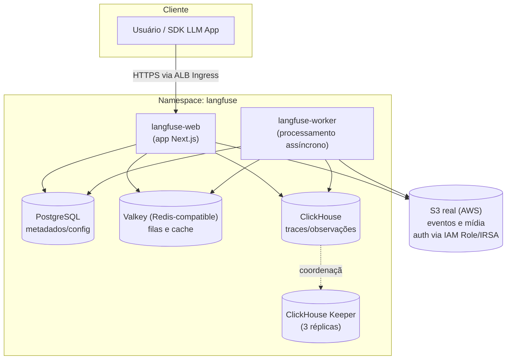

# Stack Langfuse — Documentação

> Documentação técnica da stack de observabilidade de LLMs **Langfuse**, implantada via
> [Helm chart oficial](https://langfuse.github.io/langfuse-k8s) (`langfuse/langfuse`,
> **chart 2.1.0 / appVersion 4.24.0** — versão mais recente disponível no repo no
> momento da validação).
>
> Fontes: [github.com/langfuse/langfuse-k8s](https://github.com/langfuse/langfuse-k8s)
> (README + `charts/langfuse/values.yaml` + `examples/minimal-installation/`),
> **Context7** (`/langfuse/langfuse-docs`) + validação direta com `helm template` /
> `helm lint` contra o chart real (ver seção 9).

---

## 1. Objetivo

Disponibilizar o **Langfuse** — plataforma open source de observabilidade, avaliação e
gerenciamento de prompts para aplicações LLM — em um cluster Kubernetes (Amazon EKS por
padrão), com todos os componentes de backend (banco relacional, cache e banco
analítico) provisionados junto via Helm, e S3 real autenticado por IAM Role.

---

## 2. Arquitetura



---

## 3. Serviços da stack

| Serviço | Papel | Imagem real (confirmada via `helm template`) | Arquivo de values | Réplicas | Persistência |
|---|---|---|---|---|---|
| **web** | App Next.js (UI + API) do Langfuse | `docker.langfuse.com/langfuse/langfuse:4.24.0` | `web.yaml` | 1 | — |
| **worker** | Processamento assíncrono (ingestão, batch export) | `docker.langfuse.com/langfuse/langfuse-worker:4.24.0` | `worker.yaml` | 1 | — |
| **postgresql** | Metadados, usuários, projetos, configuração | `docker.io/postgres:18` (subchart `groundhog2k/postgres`) | `postgres.yaml` | 1 | 2Gi |
| **redis** (Valkey) | Fila de ingestão consumida pelo worker + cache | `docker.io/valkey/valkey:8.0` (subchart `valkey-io/valkey`) | `worker.yaml` | 1 (standalone) | 8Gi (default do chart) |
| **clickhouse** | Armazenamento analítico de traces/observações (sink do worker) | `clickhouse/clickhouse-server:26.4` (CR `ClickHouseCluster` via ClickHouse Operator) | `worker.yaml` | 1 (cluster habilitado) | 3Gi |
| **clickhouse-keeper** | Coordenação/consenso do cluster ClickHouse | `clickhouse/clickhouse-keeper:26.4` (CR `KeeperCluster`) | `worker.yaml` | 3 | 3Gi cada |
| **s3** | Armazenamento de objetos (eventos, mídia, exports) — usado por web e worker | S3 real, auth via IAM Role/IRSA (`s3.deploy: false`) | `web.yaml` | — | — |

Todas as credenciais (exceto S3, que usa IAM Role) vêm de **um único arquivo,
`secrets.yaml`** (um `Secret` Kubernetes chamado `langfuse`, no namespace `langfuse`)
— ver seção 5.

**Só 3 arquivos de values** (`web.yaml`, `worker.yaml`, `postgres.yaml`) + `secrets.yaml`
— sem `values.yaml`/`eks.yaml` genéricos. Cada bloco de configuração vive no arquivo do
serviço mais associado a ele:

- **`web.yaml`**: tudo "voltado pra fora" — app (salt/encryptionKey/nextauth/bootstrap
  headless), Ingress (ALB), ServiceAccount (IRSA) e S3 (object storage).
- **`worker.yaml`**: o pipeline de ingestão que o worker processa — Redis (fila
  consumida pelo worker) e ClickHouse (destino dos eventos), além do app duplicado
  (mesmo padrão de auto-suficiência).
- **`postgres.yaml`**: só PostgreSQL.

Como o Helm faz merge por chave top-level (`langfuse`, `redis`, `clickhouse`, `s3`,
`postgresql`), **não importa em qual arquivo `-f` cada chave está** — o resultado
final é idêntico independente de onde a configuração foi colocada. Essa distribuição é
uma escolha de organização/legibilidade, não uma exigência técnica.

Os Dockerfiles em `docker/<serviço>/Dockerfile` **estendem exatamente essas imagens**
(confirmadas por renderização real do chart, não por suposição) — servem como ponto de
customização (certs, configs, scripts de init), não como build a partir de código-fonte
próprio.

---

## 4. Pré-requisitos

Confirmado via [github.com/langfuse/langfuse-k8s](https://github.com/langfuse/langfuse-k8s)
(README), Context7 e a documentação oficial do ClickHouse (clickhouse.com/docs):

- **Kubernetes ≥ 1.28**, **Helm ≥ 3.17** (suporte a `fromToml`, exigido pelo chart)
- **cert-manager** (`v1.20.2` recomendado) instalado no cluster (exigido pelo
  ClickHouse Operator para emitir os certificados do webhook):
  ```bash
  helm install cert-manager oci://quay.io/jetstack/charts/cert-manager \
    --version v1.20.2 -n cert-manager --create-namespace --set crds.enabled=true
  ```
- **ClickHouse Kubernetes Operator** (`0.0.5` recomendado) instalado *antes* do
  `helm install` do Langfuse (`worker.yaml` usa `crdCheck: true` e `cluster.enabled:
  true`, então as CRDs `ClickHouseCluster`/`KeeperCluster` — apiVersion
  `clickhouse.com/v1alpha1` — precisam existir no cluster):
  ```bash
  helm install clickhouse-operator oci://ghcr.io/clickhouse/clickhouse-operator-helm \
    --version 0.0.5 -n clickhouse-operator-system --create-namespace
  ```
  > Este passo só é necessário porque `clickhouse.deploy: true`. Se optar por um
  > ClickHouse externo/gerenciado (`clickhouse.deploy: false`), o operator não é
  > necessário.
- `kubectl` configurado apontando para o cluster alvo
- **O release Helm precisa se chamar exatamente `langfuse`** — os hostnames
  internos (`langfuse-postgresql`, `langfuse-redis`, `langfuse-clickhouse-headless`)
  dependem desse nome de release. Se usar outro nome, ajuste esses hosts.

Procedimento completo (com comandos de verificação) em **[DEPLOY.md](./DEPLOY.md)**,
seção 0.

### Amazon EKS (alvo padrão desta stack)

`web.yaml`/`worker.yaml`/`postgres.yaml` já vêm configurados para EKS por padrão:
Ingress via **AWS Load Balancer Controller** (ALB), S3 real via **IAM Role (IRSA)** —
sem access key/secret key fixos — e **StorageClass `gp3`** (EBS) para Postgres/Redis/
ClickHouse/Keeper. Pré-requisitos adicionais e a policy IAM mínima
(`eks-iam-policy.json`) em **[DEPLOY.md](./DEPLOY.md)**, seção 0.5.

### Testando em Kind/local (sem AWS real)

Como a stack assume EKS por padrão, testar em Kind exige sobrescrever alguns valores
via `--set` (Ingress desativado, StorageClass vazia = default do cluster, S3 apontando
para um MinIO local) — comandos prontos em **[DEPLOY.md](./DEPLOY.md)**, seção 4.1.
Nunca provisionar recursos AWS reais/pagos só para testar localmente.

### Ambiente local via Docker Compose (alternativa mais rápida ao Kind)

Para quem só quer subir a stack rapidamente sem Kubernetes, `docker-compose/`
contém uma stack equivalente baseada no `docker-compose.yml` oficial do Langfuse
v4 (confirmado via Context7), com MinIO local (não IAM Role — Compose não tem
identidade de pod) e adaptada com os mesmos valores de laboratório de `secrets.yaml`:

```bash
cd docker-compose
cp .env.example .env   # ajuste se quiser valores diferentes dos defaults
docker compose up -d
```

Diferenças em relação ao deploy K8s (Kind/EKS):

| Item | K8s (Helm chart) | Docker Compose |
|---|---|---|
| ClickHouse | Cluster + 3 Keepers via Operator | Container único, `CLICKHOUSE_CLUSTER_ENABLED: false` (sem Keeper) |
| Redis/Valkey | ACL via Secret montado como volume | Senha via `--requirepass` |
| S3 | Real (EKS, via IAM Role) ou MinIO local (Kind, via `--set`) | Serviço `minio` + `minio-init` (cria o bucket `langfuse` automaticamente) |
| Segredos | `secrets.yaml` (K8s `Secret`) | `docker-compose/.env` (mesmos valores, nunca commitado — ver `.gitignore`) |
| Bootstrap headless | `langfuse.additionalEnv` no chart | Env vars diretas no `docker-compose.yml` |

Validado de ponta a ponta: `docker compose up -d` → todos os serviços `healthy` →
bootstrap headless cria `lab-org`/`lab-project` → os 3 scripts em `tests/` rodam
com sucesso → ingestão confirmada em `events_core` no ClickHouse (mesma validação
feita no Kind).

⚠️ **Gotcha do Postgres 18+**: a imagem oficial `postgres:18` exige que `PGDATA`
fique num subdiretório do volume montado (não na raiz de `/var/lib/postgresql/data`),
senão o container entra em crash loop reclamando de "unused mount". O
`docker-compose.yml` já define `PGDATA: /var/lib/postgresql/data/pgdata` para
evitar isso — mesmo padrão usado internamente pelo subchart `groundhog2k/postgres`
do Helm chart.

```bash
docker compose down          # para os containers, mantém os volumes
docker compose down -v       # para e apaga os volumes (reset completo)
```

---

## 5. Segredos (secrets.yaml)

Todas as credenciais da stack — app (salt/encryption-key/nextauth-secret), Postgres,
Redis/Valkey, ClickHouse e o bootstrap headless (org/projeto/usuário/API key
automáticos) — ficam em **um único arquivo, `secrets.yaml`**: um manifesto `Secret`
Kubernetes (`kind: Secret`, nome `langfuse`, namespace `langfuse`) aplicado com
`kubectl apply -f secrets.yaml` **antes** do `helm install`/`upgrade` (ver
`DEPLOY.md`, seção 3). Nenhum values file contém senha em texto claro — todos
referenciam esse Secret via `existingSecret`/`secretKeyRef`.

**S3 não usa nenhum segredo** — autentica via IAM Role (IRSA), configurada em
`web.yaml` (`langfuse.serviceAccount.annotations`).

| Arquivo | Chave(s) usadas de `secrets.yaml` | Wiring no values |
|---|---|---|
| `web.yaml` / `worker.yaml` | `salt`, `encryption-key`, `nextauth-secret` | `langfuse.salt.secretKeyRef`, `langfuse.encryptionKey.secretKeyRef`, `langfuse.nextauth.secret.secretKeyRef` |
| `web.yaml` / `worker.yaml` | `LANGFUSE_INIT_*` (9 chaves) | `langfuse.additionalEnv[].valueFrom.secretKeyRef` |
| `postgres.yaml` | `postgresql-password`, `POSTGRES_USER`, `POSTGRES_PASSWORD`, `POSTGRES_DB`, `USERDB_USER`, `USERDB_PASSWORD` | `postgresql.auth.existingSecret` + `secretKeys.*` **e** `postgresql.settings.existingSecret` + `userDatabase.existingSecret` (duas referências independentes ao mesmo Secret — ver comentário em `postgres.yaml`) |
| `worker.yaml` | `redis-password`, `default` | `redis.auth.existingSecret`/`existingSecretPasswordKey` **e** `redis.auth.usersExistingSecret` (idem — dois consumidores distintos) |
| `worker.yaml` | `clickhouse-password` | `clickhouse.auth.existingSecret`/`existingSecretKey` |

✅ **Bônus confirmado via `helm template`**: se você deixar `langfuse.salt`/
`encryptionKey`/`nextauth.secret` **sem** `secretKeyRef` (valores vazios), o chart
gera esses 3 segredos automaticamente no primeiro `helm install`, persistidos numa
Secret com `helm.sh/resource-policy: keep` (sobrevive a um `helm uninstall`). Optamos
por fixá-los via `secrets.yaml` em vez de depender do autogerado porque **os mesmos
valores também alimentam Postgres/Redis/ClickHouse num único lugar**, e porque
autogerado dificulta recriar o release do zero com os mesmos dados.

⚠️ **`secrets.yaml` contém segredos em texto claro (valores de laboratório)** —
nunca reutilizar em produção. Trate como arquivo sensível: **não commitar com valores
reais** (adicione ao `.gitignore` fora do laboratório) e, para homolog/produção,
prefira gerar via secret manager externo (Vault, AWS Secrets Manager, External
Secrets Operator) em vez de um YAML versionado.

### Postgres: usuário dedicado, não superusuário

`postgres.yaml` usa o usuário/banco **dedicados `langfuse`/`langfuse`** (default do
próprio chart — não sobrescrevemos `auth.username`/`auth.database`), confirmado no
exemplo oficial `examples/minimal-installation/secret.yaml`
(`USERDB_USER: "langfuse"`). Isso corrige uma suposição anterior deste projeto de que
seria necessário o superusuário `postgres` por causa de permissão `CREATEDB` — o
exemplo oficial não faz essa ressalva.

### Variáveis válidas do bootstrap headless (`LANGFUSE_INIT_*`)

Confirmado via Context7 (`/langfuse/langfuse-docs`) — só existem estas 9 variáveis;
qualquer outra (ex: `LANGFUSE_INIT_BASE_URL`, que já apareceu num rascunho de
`secrets.yaml` e foi removida) **não é lida pela aplicação**:

| Variável | Obrigatória p/ criar o recurso |
|---|---|
| `LANGFUSE_INIT_ORG_ID` | Sim |
| `LANGFUSE_INIT_ORG_NAME` | Não |
| `LANGFUSE_INIT_PROJECT_ID` | Sim |
| `LANGFUSE_INIT_PROJECT_NAME` | Não |
| `LANGFUSE_INIT_PROJECT_RETENTION` | Não (dias de retenção; vazio = para sempre) |
| `LANGFUSE_INIT_PROJECT_PUBLIC_KEY` | Sim |
| `LANGFUSE_INIT_PROJECT_SECRET_KEY` | Sim |
| `LANGFUSE_INIT_USER_EMAIL` | Sim |
| `LANGFUSE_INIT_USER_NAME` | Não |
| `LANGFUSE_INIT_USER_PASSWORD` | Sim |

A URL pública da app é controlada por `langfuse.nextauth.url` (já wired em
`web.yaml`/`worker.yaml`) — **não** por uma variável `LANGFUSE_INIT_*`.

### Atualizando segredos após o deploy inicial

```bash
kubectl apply -f secrets.yaml
kubectl rollout restart deployment/langfuse-web deployment/langfuse-worker -n langfuse
```

`secretKeyRef` não é recarregado a quente pelo Kubernetes — o `rollout restart` é
necessário para os pods lerem os novos valores.

⚠️ **O bootstrap headless não é idempotente para atualização, só para criação**: se
você mudar `LANGFUSE_INIT_PROJECT_PUBLIC_KEY`/`_SECRET_KEY` mantendo o mesmo
`LANGFUSE_INIT_PROJECT_ID`, o Langfuse detecta que o projeto já existe e **cria uma
API key adicional** com o novo par — a antiga continua válida (confirmado consultando
a tabela `api_keys` no Postgres). Não há rotação/substituição automática; para
revogar a chave antiga, use a UI (Project Settings → API Keys) ou a API.

---

## 6. Estrutura de arquivos

```text
langfuse/
├── README.md              # este documento
├── DEPLOY.md               # procedimento de deploy passo a passo
├── secrets.yaml             # Secret K8s "langfuse" — credenciais de todos os serviços (exceto S3)
├── web.yaml                 # app (salt/encryptionKey/nextauth/bootstrap) + langfuse.web + Ingress ALB + ServiceAccount IRSA + S3
├── worker.yaml               # app (duplicado) + langfuse.worker + Redis/Valkey + ClickHouse + Keeper
├── postgres.yaml             # postgresql (usuário dedicado "langfuse", existingSecret -> secrets.yaml)
├── eks-iam-policy.json        # policy IAM mínima p/ a Role IRSA (s3:PutObject/ListBucket/GetObject)
├── docker/
│   ├── web/Dockerfile
│   ├── worker/Dockerfile
│   ├── postgres/Dockerfile
│   ├── redis/Dockerfile
│   ├── clickhouse/Dockerfile
│   └── clickhouse-keeper/Dockerfile
├── docker-compose/
│   ├── docker-compose.yml   # stack completa (web/worker/postgres/valkey/clickhouse/minio) p/ rodar local
│   └── .env.example          # valores de laboratório (copiar p/ .env, nunca commitar)
└── tests/
    ├── teste-langfuse.py       # valida envio de trace via SDK Python
    ├── teste-otel.py           # valida fluxo RAG (span + generation aninhados)
    └── teste-sdk.py            # exemplo básico de instrumentação
```

---

## 7. Resumo Executivo

### Objetivo

Prover uma plataforma self-hosted de observabilidade para aplicações de IA/LLM
(rastreamento de prompts, custos de tokens, avaliação de qualidade), rodando de forma
independente dentro do próprio cluster Kubernetes do cliente (Amazon EKS).

### Benefícios

- **Técnicos**: observabilidade nativa para chamadas de LLM (traces, spans,
  generations), sem enviar dados sensíveis para SaaS de terceiros.
- **Operacionais**: stack 100% declarativa via Helm + values versionados (só 3
  arquivos + segredos); deploy reproduzível em EKS, com caminho de teste local
  (Kind/Docker Compose) documentado.
- **Segurança**: S3 autenticado via IAM Role (IRSA) — nenhuma credencial estática de
  object storage circulando em Secrets ou values.
- **Financeiros**: elimina custo de licenciamento SaaS do Langfuse Cloud; custo passa a
  ser apenas a infraestrutura já existente do cliente.

### Riscos

| Risco | Impacto | Mitigação |
|---|---|---|
| `secrets.yaml` contém todas as senhas em texto claro (valores de laboratório) | Alto | Nunca commitar com valores reais; usar secret manager externo em homolog/prod (ver seção 5) |
| Postgres, Redis e ClickHouse com 1 réplica cada (exceto Keeper) | Médio | Sem HA real; avaliar `cluster.replicas`/`web.replicas`/`worker.replicas` maiores para homolog/prod |
| Sem `NetworkPolicy` definida | Médio | Adicionar antes de expor publicamente |
| Ingress/TLS/IRSA (`web.yaml`) usam placeholders (`<SEU_DOMINIO>`, ARNs) — não funcionam até serem substituídos | Alto | Preencher antes do deploy; `helm template` não valida se são reais |
| ClickHouse Operator + cert-manager são pré-requisitos externos ao chart | Médio | Comandos de instalação documentados na seção 4 / `DEPLOY.md` seção 0 |
| ClickHouse Kubernetes Operator é classificado como *alpha-quality* pelo próprio chart do Langfuse (comentário no `values.yaml` oficial) | Médio | Revisar release notes antes de upgrades; fixar a versão do operator explicitamente (`--version`) em vez de usar sempre "latest" |
| Imagens Docker customizadas ainda não fixam SHA256 (só tag) | Baixo | Fixar digest antes de produção |

### Custos (Cost Drivers)

| Serviço | Motivo do custo | Observações |
|---|---|---|
| Compute (nós do cluster) | CPU/memória para web, worker, postgres, redis, clickhouse e 3 keepers rodando simultaneamente | Requests somados: ~425m CPU / ~2.9Gi mem (sem contar keeper, sem limite definido) |
| Armazenamento EBS `gp3` | Persistência de Postgres (2Gi) + ClickHouse (3Gi) + Keeper (3× 3Gi = 9Gi) | Total ≈ 14Gi de volumes persistentes |
| S3 | Eventos e mídia do Langfuse (`web.yaml`) | Armazenamento + requests; zero custo de credencial (IAM Role, não access key) |
| ALB | Load Balancer do Ingress (AWS Load Balancer Controller) | Custo fixo por hora + por LCU; certificado ACM em si é gratuito |
| Rede (data transfer) | Tráfego entre web/worker e os bancos, e ingress externo | Baixo em cluster único; considerar se multi-AZ/multi-região |
| Licenciamento | Nenhum — Langfuse é open source (self-hosted) | Sem custo de software |

> Estimativa qualitativa — não há preços fechados pois depende da região AWS e da
> classe dos nós/volumes escolhidos.

---

## 8. Próximos passos

Veja **[DEPLOY.md](./DEPLOY.md)** para o procedimento de instalação passo a passo.

---

## 9. Validação executada

Os arquivos de values foram validados contra o chart real (`langfuse/langfuse` 2.1.0)
em múltiplas rodadas, conforme a stack evoluiu:

```bash
helm repo add langfuse https://langfuse.github.io/langfuse-k8s
helm repo update

helm template langfuse langfuse/langfuse -n langfuse \
  -f web.yaml -f worker.yaml -f postgres.yaml \
  --api-versions clickhouse.com/v1alpha1/ClickHouseCluster \
  --api-versions clickhouse.com/v1alpha1/KeeperCluster

helm lint <chart-local> \
  -f web.yaml -f worker.yaml -f postgres.yaml \
  --set clickhouse.crdCheck=false
```

Resultado: **0 erros** em todas as rodadas. Ao longo do projeto, **6 bugs reais** foram
encontrados e corrigidos nas primeiras versões dos arquivos (chaves que não existem no
schema do chart e eram silenciosamente ignoradas — Helm não falha em chaves
desconhecidas). Registro histórico (as chaves já não existem mais nesta versão dos
arquivos, foram consolidadas/renomeadas nas reconstruções seguintes):

| Contexto (histórico) | Chave errada (ignorada) | Chave correta |
|---|---|---|
| Postgres | `persistence.size` | `storage.requestedSize` |
| Redis | `architecture: standalone` (chave inexistente no chart) | removida (modo standalone já é o default) |
| ClickHouse | `resources` e `storage.size` no topo de `clickhouse` | `cluster.resources` e `cluster.storage.size` |
| Web/Worker | `langfuse.replicaCount` (chave inexistente) | `langfuse.web.replicas` / `langfuse.worker.replicas` |
| Web/Worker | `langfuse.env.*` (chave inexistente — S3\_\* nunca chegavam à app) | `s3.*` estruturado + `langfuse.additionalEnv` para variáveis sem equivalente estruturado |
| S3 | `s3.auth.accessKeyId`/`secretAccessKey` como string simples (schema exige objeto `{value\|secretKeyRef}`; `s3.auth.*` no chart real é para o gateway SeaweedFS embutido) | `s3.accessKeyId`/`s3.secretAccessKey` (top-level, fora de `auth:`) — hoje nem preenchidos, pois S3 usa IAM Role |

> `--api-versions ...` simula as CRDs do ClickHouse Operator apenas para permitir a
> renderização offline (`crdCheck: true` bloqueia `helm template` sem um cluster real
> conectado, que é o comportamento correto para um `helm install` de verdade).

**Validado ao vivo no Kind** (`langfuse-lab`) após a reconstrução com usuário dedicado
do Postgres: todos os pods `Running`, `DATABASE_USERNAME`/`DATABASE_NAME` = `langfuse`
confirmados no manifesto renderizado, bootstrap headless funcionando, os 3 scripts de
`tests/` rodaram com sucesso e **6 eventos** confirmados em `events_core` no ClickHouse.
