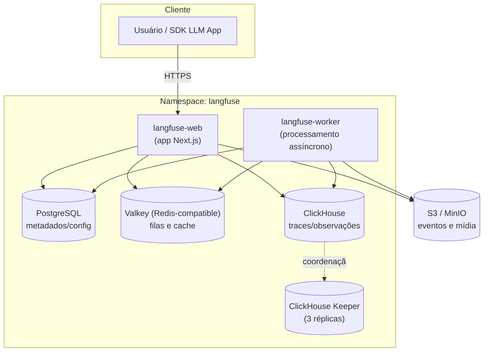

# Stack Langfuse — Documentação

> Documentação técnica da stack de observabilidade de LLMs **Langfuse**, implantada via
> [Helm chart oficial](https://langfuse.github.io/langfuse-k8s) (`langfuse/langfuse`,
> **chart 2.1.0 / appVersion 4.24.0** — versão mais recente disponível no repo no
> momento da validação).
> Fontes: **Context7** (`/langfuse/langfuse-docs`) + validação direta com
> `helm template` / `helm lint` contra o chart real (ver seção 9).

---

## 1. Objetivo

Disponibilizar o **Langfuse** — plataforma open source de observabilidade, avaliação e
gerenciamento de prompts para aplicações LLM — em um cluster Kubernetes, com todos os
componentes de backend (banco relacional, cache e banco analítico) provisionados junto
via Helm.

---

## 2. Arquitetura



---

## 3. Serviços da stack

| Serviço | Papel | Imagem real (confirmada via `helm template`) | Arquivo de values | Réplicas | Persistência |
|---|---|---|---|---|---|
| **web** | App Next.js (UI + API) do Langfuse | `docker.langfuse.com/langfuse/langfuse:4.24.0` | `web.yaml` | 1 | — |
| **worker** | Processamento assíncrono (ingestão, batch export) | `docker.langfuse.com/langfuse/langfuse-worker:4.24.0` | `worker.yaml` | 1 | — |
| **postgresql** | Metadados, usuários, projetos, configuração | `docker.io/postgres:18` (subchart `groundhog2k/postgres`) | `postgres.yaml` | 1 | 2Gi |
| **redis** (Valkey) | Filas de ingestão e cache | `docker.io/valkey/valkey:8.0` (subchart `valkey-io/valkey`) | `redis.yaml` | 1 (standalone) | 8Gi (default do chart, não sobrescrito) |
| **clickhouse** | Armazenamento analítico de traces/observações | `clickhouse/clickhouse-server:26.4` (CR `ClickHouseCluster` via ClickHouse Operator) | `clickhouse.yaml` | 1 (cluster habilitado) | 3Gi |
| **clickhouse-keeper** | Coordenação/consenso do cluster ClickHouse | `clickhouse/clickhouse-keeper:26.4` (CR `KeeperCluster`) | `clickhouse.yaml` | 3 | 3Gi cada |
| **s3/MinIO** | Armazenamento de objetos (eventos, mídia, exports) | externo (`s3.deploy: false`; chart também oferece SeaweedFS bundled via `seaweedfs.enabled`, aqui desativado) | `values.yaml` (local) / `eks.yaml` (S3 real via IRSA) | — | — |

Todas as credenciais acima vêm de **um único arquivo, `secrets.yaml`** (um `Secret`
Kubernetes chamado `langfuse`, no namespace `langfuse`) — ver seção 5.

Os Dockerfiles em `docker/<serviço>/Dockerfile` **estendem exatamente essas imagens**
(confirmadas por renderização real do chart, não por suposição) — servem como ponto de
customização (certs, configs, scripts de init), não como build a partir de código-fonte
próprio. Note que **não são imagens Bitnami** (correção em relação a uma versão anterior
deste documento).

---

## 4. Pré-requisitos

Confirmado via documentação oficial (Context7) e documentação oficial do ClickHouse
(clickhouse.com/docs):

- **Kubernetes ≥ 1.28**
- **cert-manager** instalado no cluster (exigido pelo ClickHouse Operator para emitir
  os certificados do webhook):
  ```bash
  helm install cert-manager oci://quay.io/jetstack/charts/cert-manager \
    -n cert-manager --create-namespace --set crds.enabled=true
  ```
- **ClickHouse Kubernetes Operator** instalado *antes* do `helm install` do Langfuse
  (nossa `clickhouse.yaml` usa `crdCheck: true` e `cluster.enabled: true`, então as
  CRDs `ClickHouseCluster`/`KeeperCluster` — apiVersion `clickhouse.com/v1alpha1` —
  precisam existir no cluster):
  ```bash
  helm install clickhouse-operator oci://ghcr.io/clickhouse/clickhouse-operator-helm \
    -n clickhouse-operator-system --create-namespace
  ```
  > Este passo só é necessário porque `clickhouse.deploy: true`. Se optar por um
  > ClickHouse externo/gerenciado (`clickhouse.deploy: false`), o operator não é
  > necessário.
- `helm` (≥ 3.x) e `kubectl` configurados apontando para o cluster alvo
- **O release Helm precisa se chamar exatamente `langfuse`** — os hostnames em
  `postgres.yaml` (`langfuse-postgresql`), `redis.yaml` (`langfuse-redis`) e
  `clickhouse.yaml` (`langfuse-clickhouse-headless`) dependem desse nome de release.
  Se usar outro nome, ajuste esses hosts.

Procedimento completo (com comandos de verificação) em **[DEPLOY.md](./DEPLOY.md)**,
seção 0.

### Amazon EKS (produção/homolog)

Além dos pré-requisitos acima, deploy em EKS precisa de: **AWS Load Balancer
Controller** (Ingress ALB), **EBS CSI Driver + StorageClass `gp3`**, um **bucket S3**
real e uma **IAM Role (IRSA)** associada à Service Account do Langfuse. O arquivo
**`eks.yaml`** (overlay aplicado por cima dos demais) já traz esses ajustes prontos
— só falta trocar os placeholders `<...>` (domínio, ARNs, bucket, região). Detalhes
completos em **[DEPLOY.md](./DEPLOY.md)**, seção 0.5.

### Ambiente local (custo zero)

Para laboratório/local, use **Kind** (cluster Kubernetes) + **LocalStack** para o S3
(já refletido em `values.yaml`, que aponta `S3_ENDPOINT` para um MinIO local em vez de
AWS S3 real). Nunca provisionar recursos AWS pagos para este cenário.

### Ambiente local via Docker Compose (alternativa mais rápida ao Kind)

Para quem só quer subir a stack rapidamente sem Kubernetes, `docker-compose/`
contém uma stack equivalente baseada no `docker-compose.yml` oficial do Langfuse
v4 (confirmado via Context7), adaptada com os mesmos valores de laboratório de
`secrets.yaml`:

```bash
cd docker-compose
cp .env.example .env   # ajuste se quiser valores diferentes dos defaults
docker compose up -d
```

Diferenças em relação ao deploy K8s (Kind/EKS):

| Item | K8s (Helm chart) | Docker Compose |
|---|---|---|
| ClickHouse | Cluster + 3 Keepers via Operator | Container único, `CLICKHOUSE_CLUSTER_ENABLED: false` (sem Keeper) |
| Redis/Valkey | ACL via Secret montado como volume | Senha via `--requirepass` |
| S3/MinIO | Deploy manual à parte (não gerenciado pelo chart) | Serviço `minio` + `minio-init` (cria o bucket `langfuse` automaticamente) |
| Segredos | `secrets.yaml` (K8s `Secret`) | `docker-compose/.env` (mesmos valores, nunca commitado — ver `.gitignore`) |
| Bootstrap headless | `langfuse.additionalEnv` no chart | Env vars diretas no `docker-compose.yml` |

Validado de ponta a ponta: `docker compose up -d` → todos os serviços `healthy` →
bootstrap headless cria `lab-org`/`lab-project` → os 3 scripts em `tests/` rodam
com sucesso → ingestão confirmada em `events_core` no ClickHouse (mesma validação
feita no Kind).

⚠️ **Gotcha do Postgres 18+**: a imagem oficial `postgres:18` exige que `PGDATA`
fique num subdiretório do volume montado (não na raiz de `/var/lib/postgresql/data`),
senão o container entra em crash loop reclamando de "unused mount". O
`docker-compose.yml` já define `PGDATA: /var/lib/postgresql/data/pgdata` para
evitar isso — mesmo padrão usado internamente pelo subchart `groundhog2k/postgres`
do Helm chart.

```bash
docker compose down          # para os containers, mantém os volumes
docker compose down -v       # para e apaga os volumes (reset completo)
```

---

## 5. Segredos (secrets.yaml)

Todas as credenciais da stack — app (salt/encryption-key/nextauth-secret), Postgres,
Redis/Valkey, ClickHouse, S3/MinIO e o bootstrap headless (org/projeto/usuário/API key
automáticos) — ficam em **um único arquivo, `secrets.yaml`**: um manifesto `Secret`
Kubernetes (`kind: Secret`, nome `langfuse`, namespace `langfuse`) aplicado com
`kubectl apply -f secrets.yaml` **antes** do `helm install`/`upgrade` (ver
`DEPLOY.md`, seção 3). Nenhum values file contém senha em texto claro — todos
referenciam esse Secret via `existingSecret`/`secretKeyRef`.

| Arquivo | Chave(s) usadas de `secrets.yaml` | Wiring no values |
|---|---|---|
| `web.yaml` / `worker.yaml` | `salt`, `encryption-key`, `nextauth-secret` | `langfuse.salt.secretKeyRef`, `langfuse.encryptionKey.secretKeyRef`, `langfuse.nextauth.secret.secretKeyRef` |
| `web.yaml` / `worker.yaml` | `LANGFUSE_INIT_*` (9 chaves) | `langfuse.additionalEnv[].valueFrom.secretKeyRef` |
| `postgres.yaml` | `postgresql-password`, `POSTGRES_USER`, `POSTGRES_PASSWORD`, `POSTGRES_DB`, `USERDB_USER`, `USERDB_PASSWORD` | `postgresql.auth.existingSecret` + `secretKeys.*` **e** `postgresql.settings.existingSecret` + `userDatabase.existingSecret` (duas referências independentes ao mesmo Secret — ver comentário em `postgres.yaml`) |
| `redis.yaml` | `redis-password`, `default` | `redis.auth.existingSecret`/`existingSecretPasswordKey` **e** `redis.auth.usersExistingSecret` (idem — dois consumidores distintos) |
| `clickhouse.yaml` | `clickhouse-password` | `clickhouse.auth.existingSecret`/`existingSecretKey` |
| `values.yaml` | `s3-access-key`, `s3-secret-key` | `s3.accessKeyId.secretKeyRef`, `s3.secretAccessKey.secretKeyRef` |

✅ **Bônus confirmado via `helm template`**: se você deixar `langfuse.salt`/
`encryptionKey`/`nextauth.secret` **sem** `secretKeyRef` (valores vazios), o chart
gera esses 3 segredos automaticamente no primeiro `helm install`, persistidos numa
Secret com `helm.sh/resource-policy: keep` (sobrevive a um `helm uninstall`). Optamos
por fixá-los via `secrets.yaml` em vez de depender do autogerado porque **os mesmos
valores também alimentam Postgres/Redis/ClickHouse/S3 num único lugar**, e porque
autogerado dificulta recriar o release do zero com os mesmos dados.

⚠️ **`secrets.yaml` contém segredos em texto claro (valores de laboratório)** —
nunca reutilizar em produção. Trate como arquivo sensível: **não commitar com valores
reais** (adicione ao `.gitignore` fora do laboratório) e, para homolog/produção,
prefira gerar via secret manager externo (Vault, AWS Secrets Manager, External
Secrets Operator) em vez de um YAML versionado.

### Variáveis válidas do bootstrap headless (`LANGFUSE_INIT_*`)

Confirmado via Context7 (`/langfuse/langfuse-docs`) — só existem estas 9 variáveis;
qualquer outra (ex: `LANGFUSE_INIT_BASE_URL`, que já apareceu num rascunho de
`secrets.yaml` e foi removida) **não é lida pela aplicação**:

| Variável | Obrigatória p/ criar o recurso |
|---|---|
| `LANGFUSE_INIT_ORG_ID` | Sim |
| `LANGFUSE_INIT_ORG_NAME` | Não |
| `LANGFUSE_INIT_PROJECT_ID` | Sim |
| `LANGFUSE_INIT_PROJECT_NAME` | Não |
| `LANGFUSE_INIT_PROJECT_RETENTION` | Não (dias de retenção; vazio = para sempre) |
| `LANGFUSE_INIT_PROJECT_PUBLIC_KEY` | Sim |
| `LANGFUSE_INIT_PROJECT_SECRET_KEY` | Sim |
| `LANGFUSE_INIT_USER_EMAIL` | Sim |
| `LANGFUSE_INIT_USER_NAME` | Não |
| `LANGFUSE_INIT_USER_PASSWORD` | Sim |

A URL pública da app é controlada por `langfuse.nextauth.url` (já wired em
`web.yaml`/`worker.yaml`) — **não** por uma variável `LANGFUSE_INIT_*`.

### Atualizando segredos após o deploy inicial

```bash
kubectl apply -f secrets.yaml
kubectl rollout restart deployment/langfuse-web deployment/langfuse-worker -n langfuse
```

`secretKeyRef` não é recarregado a quente pelo Kubernetes — o `rollout restart` é
necessário para os pods lerem os novos valores.

⚠️ **O bootstrap headless não é idempotente para atualização, só para criação**: se
você mudar `LANGFUSE_INIT_PROJECT_PUBLIC_KEY`/`_SECRET_KEY` mantendo o mesmo
`LANGFUSE_INIT_PROJECT_ID`, o Langfuse detecta que o projeto já existe e **cria uma
API key adicional** com o novo par — a antiga continua válida (confirmado consultando
a tabela `api_keys` no Postgres). Não há rotação/substituição automática; para
revogar a chave antiga, use a UI (Project Settings → API Keys) ou a API.

---

## 6. Estrutura de arquivos

```text
langfuse/
├── README.md              # este documento
├── DEPLOY.md               # procedimento de deploy passo a passo
├── secrets.yaml             # Secret K8s "langfuse" — credenciais de TODOS os serviços
├── values.yaml              # base: storage S3/MinIO + índice dos demais arquivos
├── web.yaml                 # salt/encryptionKey/nextauth/additionalEnv (compartilhado) + langfuse.web
├── worker.yaml               # salt/encryptionKey/nextauth/additionalEnv (compartilhado) + langfuse.worker
├── postgres.yaml             # postgresql (existingSecret -> secrets.yaml)
├── redis.yaml                 # redis/Valkey (existingSecret -> secrets.yaml)
├── clickhouse.yaml            # clickhouse + keeper (existingSecret -> secrets.yaml)
├── eks.yaml                   # overlay opcional p/ Amazon EKS (Ingress ALB, S3 real/IRSA, StorageClass gp3)
├── docker/
│   ├── web/Dockerfile
│   ├── worker/Dockerfile
│   ├── postgres/Dockerfile
│   ├── redis/Dockerfile
│   ├── clickhouse/Dockerfile
│   └── clickhouse-keeper/Dockerfile
├── docker-compose/
│   ├── docker-compose.yml   # stack completa (web/worker/postgres/valkey/clickhouse/minio) p/ rodar local
│   └── .env.example          # valores de laboratório (copiar p/ .env, nunca commitar)
└── tests/
    ├── teste-langfuse.py       # valida envio de trace via SDK Python
    ├── teste-otel.py           # valida fluxo RAG (span + generation aninhados)
    └── teste-sdk.py            # exemplo básico de instrumentação
```

---

## 7. Resumo Executivo

### Objetivo

Prover uma plataforma self-hosted de observabilidade para aplicações de IA/LLM
(rastreamento de prompts, custos de tokens, avaliação de qualidade), rodando de forma
independente dentro do próprio cluster Kubernetes do cliente.

### Benefícios

- **Técnicos**: observabilidade nativa para chamadas de LLM (traces, spans,
  generations), sem enviar dados sensíveis para SaaS de terceiros.
- **Operacionais**: stack 100% declarativa via Helm + values versionados; deploy
  reproduzível em qualquer ambiente (local, homolog, prod).
- **Financeiros**: elimina custo de licenciamento SaaS do Langfuse Cloud; custo passa a
  ser apenas a infraestrutura já existente do cliente.

### Riscos

| Risco | Impacto | Mitigação |
|---|---|---|
| `secrets.yaml` contém todas as senhas em texto claro (valores de laboratório) | Alto | Nunca commitar com valores reais; usar secret manager externo em homolog/prod (ver seção 5) |
| Postgres, Redis e ClickHouse com 1 réplica cada (exceto Keeper) | Médio | Sem HA real; avaliar `cluster.replicas`/`web.replicas`/`worker.replicas` maiores para homolog/prod |
| Sem `NetworkPolicy` definida | Médio | Adicionar antes de expor publicamente |
| Ingress/TLS (`eks.yaml`) usa placeholders (`<SEU_DOMINIO>`, ARNs) — não funciona até serem substituídos | Alto (só em EKS) | Preencher antes do deploy; `helm template` não valida se são reais |
| ClickHouse Operator + cert-manager são pré-requisitos externos ao chart | Médio | Comandos de instalação documentados na seção 4 / `DEPLOY.md` seção 0 |
| ClickHouse Kubernetes Operator é classificado como *alpha-quality* pelo próprio chart do Langfuse (comentário no `values.yaml` oficial) | Médio | Revisar release notes antes de upgrades; fixar a versão do operator explicitamente (`--set manager.image.tag=<versão>`) em vez de usar sempre "latest" |
| Imagens Docker customizadas ainda não fixam SHA256 (só tag) | Baixo | Fixar digest antes de produção |

### Custos (Cost Drivers)

| Serviço | Motivo do custo | Observações |
|---|---|---|
| Compute (nós do cluster) | CPU/memória para web, worker, postgres, redis, clickhouse e 3 keepers rodando simultaneamente | Requests somados: ~425m CPU / ~2.9Gi mem (sem contar keeper, sem limite definido) |
| Armazenamento (PV/EBS) | Persistência de Postgres (2Gi) + ClickHouse (3Gi) + Keeper (3× 3Gi = 9Gi) | Total ≈ 14Gi de volumes persistentes |
| S3 / object storage | Eventos e mídia do Langfuse (`values.yaml`) | Zero custo se usar MinIO/LocalStack local; custo real de S3 (armazenamento + requests) em EKS via `eks.yaml` |
| Rede (data transfer) | Tráfego entre web/worker e os bancos, e ingress externo | Baixo em cluster único; considerar se multi-AZ/multi-região |
| ALB (`eks.yaml`, EKS only) | Load Balancer do Ingress (AWS Load Balancer Controller) | Custo fixo por hora + por LCU; certificado ACM em si é gratuito |
| EBS gp3 (`eks.yaml`, EKS only) | Volumes de Postgres/ClickHouse/Keeper via StorageClass `gp3` | Substitui o `standard` (local-path) do Kind, que não tem custo |
| Licenciamento | Nenhum — Langfuse é open source (self-hosted) | Sem custo de software |

> Estimativa qualitativa — não há preços fechados pois depende do provedor
> (EKS/GKE/AKS/on-prem) e da classe dos nós/volumes escolhidos.

---

## 8. Próximos passos

Veja **[DEPLOY.md](./DEPLOY.md)** para o procedimento de instalação passo a passo.

---

## 9. Validação executada

Os arquivos de values (`postgres.yaml`, `redis.yaml`, `clickhouse.yaml`, `web.yaml`,
`worker.yaml`) foram validados contra o chart real (`langfuse/langfuse` 2.1.0):

```bash
helm repo add langfuse https://langfuse.github.io/langfuse-k8s
helm repo update

helm template langfuse langfuse/langfuse -n langfuse \
  -f values.yaml -f web.yaml -f worker.yaml -f postgres.yaml -f redis.yaml -f clickhouse.yaml \
  --api-versions clickhouse.com/v1alpha1/ClickHouseCluster \
  --api-versions clickhouse.com/v1alpha1/KeeperCluster

helm lint <chart-local> \
  -f values.yaml -f web.yaml -f worker.yaml -f postgres.yaml -f redis.yaml -f clickhouse.yaml \
  --set clickhouse.crdCheck=false
```

Resultado: **0 erros** em ambos, em duas rodadas de validação. Ao todo, **6 bugs reais**
foram encontrados e corrigidos (chaves que não existem no schema do chart e eram
silenciosamente ignoradas — Helm não falha em chaves desconhecidas):

| Arquivo | Chave errada (ignorada) | Chave correta |
|---|---|---|
| `postgres.yaml` | `persistence.size` | `storage.requestedSize` |
| `redis.yaml` | `architecture: standalone` (chave inexistente no chart) | removida (modo standalone já é o default) |
| `clickhouse.yaml` | `resources` e `storage.size` no topo de `clickhouse` | `cluster.resources` e `cluster.storage.size` |
| `web.yaml` / `worker.yaml` | `langfuse.replicaCount` (chave inexistente) | `langfuse.web.replicas` / `langfuse.worker.replicas` |
| `web.yaml` / `worker.yaml` | `langfuse.env.*` (chave inexistente — S3\_\* nunca chegavam à app) | `s3.*` estruturado em `values.yaml` + `langfuse.additionalEnv` para variáveis sem equivalente estruturado (ex: `LANGFUSE_INIT_*`) |
| `values.yaml` | `s3.auth.accessKeyId`/`secretAccessKey` como string simples (schema exige objeto `{value\|secretKeyRef}`; e `s3.auth.*` no chart real é para o gateway SeaweedFS embutido, não para as credenciais do Langfuse) | `s3.accessKeyId.secretKeyRef` / `s3.secretAccessKey.secretKeyRef` (top-level, fora de `auth:`) |

> `--api-versions ...` simula as CRDs do ClickHouse Operator apenas para permitir a
> renderização offline (`crdCheck: true` bloqueia `helm template` sem um cluster real
> conectado, que é o comportamento correto para um `helm install` de verdade).

Adicionalmente, a wiring de `secrets.yaml` foi confirmada linha a linha no manifesto
renderizado — incluindo o script de init do subchart Valkey, que lê a senha ACL em
`/valkey-users-secret/default` (montado a partir do nosso Secret `langfuse`), e os
containers de `postgresql` recebendo `POSTGRES_USER`/`POSTGRES_PASSWORD`/`POSTGRES_DB`/
`USERDB_USER`/`USERDB_PASSWORD` via `secretKeyRef` do mesmo Secret.

